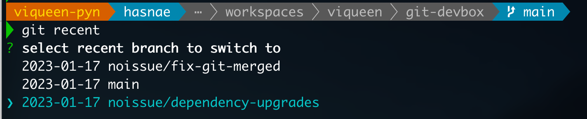
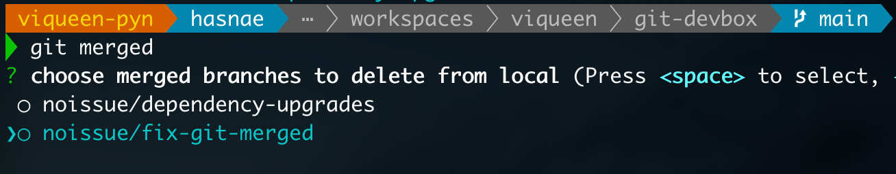

## git-devbox

[](https://sonarcloud.io/summary/new_code?id=viqueen_git-devbox)
[](https://snyk.io/test/github/viqueen/git-devbox?targetFile=package.json)

### install it

#### from stable

- with **homebrew** (preferred)

```bash
brew tap viqueen/git-devbox
brew install git-devbox
```

- with **npm** (not recommended)

```bash
npm install git-devbox -g
```

#### from source

```bash
git clone https://github.com/viqueen/git-devbox.git
cd git-devbox
npm install
npm link
```

### use it

#### working with branches

- list recent git branches that you've interacted with locally, select one to check it out

```bash
git recent
```



- list merged git branches that you still have locally, multi select the ones you want to delete

```bash
git merde
```



#### setup git workspaces

- start by some configuration

```bash
git devbox
```

it will add the following git global config entries

```text
devbox.workspaces.root          # where you want all your workspaces to be
devbox.workspaces.default       # your default workspace, i.e open-source vs work
devbox.github.username          # your github username
devbox.github.personal.token    # your github personal access token
```

- add a repo to your workspace

```bash
git workspace-add <urlConnection>         # adds to default workspace
git workspace-add <urlConnect> -w <name>  # adds to workspace with provided name
```

- view your workspace

```bash
git workspace             # describes default workspace
git workspace -w <name>   # describes workspace with provided name
```

- clone your entire workspace

```bash
git workspace-clone
git workspace-clone -w <name>
```

- sync workspace with GitHub, it requires GitHub username and token to be set when working with private repos

```bash
git sync-github --user <namespace>
git sync-github --org <namespace>
git sync-github --org <namespace> --archived  # include archived
git sync-github --user <namespace> --forked   # include forked
```
